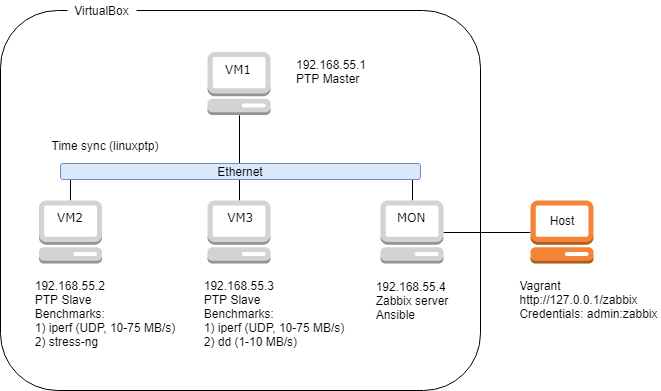

# Stress monitor hands-on work

- Trained technologies: Vagrant, Ansible, Zabbix, Python, PTP4L, VirtualBox, Ubuntu.
- Stress software: stress-ng, iperf, dd + throttle.
- Monitoring software: zabbix.
- Monitored indicators: CPU load, Memory, IO, network, PTP daemon state and PTP master offset.
- Additional rules: monitoring indicators should be reported every 100 ms or less.

## Description.
Task execution includes solving these subtasks:
1. set up Linux-based virtual machines (Ubuntu, Debian, Fedora, CentOS) to provide network communication and time sync over IEEE 1582v2 protocol (PTP);
2. launch stress tests on various OS subsystems (network, disks, CPU, memory);
3. gather statistics on various metrics with **an interval of 100 ms or less**. Metrics: PTP state, PTP master time offset, load: CPU, memory, io, network (min, max, average, 95 and 99 percentile);
4. visualize statistics using zabbix/grafana/... with the ability to see subsecond intervals.

### Scheme:

For stress tests execution iperf, stress-ng, dd, iostat, ioping, perf, atop are offered for use. This list could be changed if needed.

For stress test simulation it's recommended that you use CPU pinning.

You have to show stress test execution with statistics gathering on the VM (2 or 3) at one container at least.

## Deploy instructions:
- install Vagrant and VirtualBox
- clone repository
- run `vagrant up` in repository directory
- wait for deploy
- open http://127.0.0.1/zabbix to watch perfomance graphs, default credentials admin:zabbix
